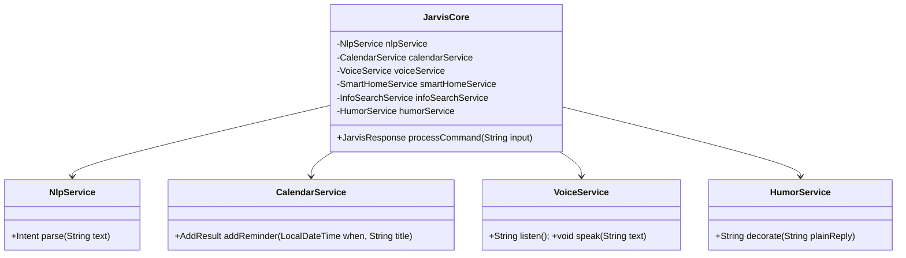
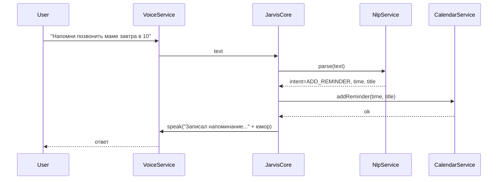

# Техническое задание: Голосовой ИИ-ассистент «Jarvis»

---

## 1. Общее описание

- **Назначение**: Персональный голосовой ИИ-ассистент для управления повседневными задачами, интеграций и умного дома с элементами юмора и сарказма в диалогах.
- **ЦА**: Технически подкованные пользователи, энтузиасты умного дома, power users.
- **Платформа**: Desktop (Windows/macOS/Linux) + REST API; опционально Telegram/веб UI.

## 2. Функциональные требования

2.1. Голосовое взаимодействие
- Распознавание речи (STT) и синтез речи (TTS).
- Горячая фраза (опционально) и push-to-talk режим.

2.2. Управление умным домом
- Интеграции: Home Assistant API, MQTT (Eclipse Paho).
- Команды: свет, климат, музыка, сцены.

2.3. Поиск и анализ информации
- Веб-поиск, краткие сводки, ответы с источниками.
- Парсинг HTML (Jsoup), HTTP-запросы (Apache HttpClient).

2.4. Календарь и напоминания
- Создание/чтение/удаление событий; напоминания.
- Интеграция: Google Calendar API; локальное хранилище как fallback.

2.5. Управление файлами и приложениями
- Открытие файлов, запуск программ, операции с папками (Java NIO/ProcessBuilder).

2.6. Ведение диалога
- Обработка естественного языка (GPT/Dialogflow/Rasa).
- Юмор/сарказм: вариативные ответы, персонализация тона.

2.7. Безопасность
- Распознавание лиц (OpenCV) и/или голоса для аутентификации.
- Роли: владелец, гость; настройка прав на модули.

2.8. Визуализация
- Графики/дашборды (usage, календари, IoT) через веб UI (Vaadin/React) или JavaFX.

2.9. Интеграции с почтой и мессенджерами
- Email (JavaMail), Telegram Bot API.

2.10. Мультиязычность
- RU/EN минимум; переключение на лету.

## 3. Нефункциональные требования

- Надёжность: устойчивость к сетевым ошибкам, ретраи, таймауты.
- Производительность: ответ до 300 мс для локальных команд; интеграции — до 2 с.
- Масштабируемость: модульная архитектура, возможность выноса модулей в отдельные сервисы.
- Логирование: SLF4J + структурные логи; трассировка запросов.
- Тестирование: JUnit, интеграционные тесты для модулей.

## 4. Технологический стек

- Язык: Java 17+
- Framework: Spring Boot 3.x
- Голос: Google Cloud STT/TTS (или Vosk/Coqui TTS локально)
- NLP: OpenAI GPT API / Dialogflow; локально — Rasa
- IoT: Home Assistant REST/WebSocket, MQTT (Eclipse Paho)
- Веб: Spring Web + (опционально) Vaadin/React
- Безопасность: Spring Security, OpenCV Java bindings
- Интеграции: Google Calendar API, JavaMail, Telegram Bot API
- БД: SQLite (MVP) или PostgreSQL
- Сборка: Maven/Gradle; Логи: SLF4J; Тесты: JUnit

## 5. Архитектура (Mermaid)

```mermaid
flowchart LR
    U[(User)]
    subgraph I[Input/Output]
      STT[Speech-to-Text]
      TTS[Text-to-Speech]
      UI[Text UI / REST]
    end
    CORE[JarvisCore (NLP Orchestrator)]
    SEC[Auth Service (Face/Voice)]
    subgraph Modules
      HOME[SmartHomeService]
      CAL[CalendarService]
      FILES[FilesAppsService]
      WEB[WebAutomation]
      INFO[InfoSearchService]
      MAIL[MailMessengerService]
      VIS[VisualizationService]
      HUMOR[HumorService]
    end
    INTEG[External APIs: OpenAI/Dialogflow, GCal, Telegram, HomeAssistant, MQTT]
    DB[(DB: SQLite/PostgreSQL)]

    U -- voice --> STT --> CORE
    U -- text  --> UI  --> CORE
    CORE --> HUMOR
    CORE --> SEC
    CORE --> HOME
    CORE --> CAL
    CORE --> FILES
    CORE --> WEB
    CORE --> INFO
    CORE --> MAIL
    CORE --> VIS
    CORE <--> DB
    Modules <--> INTEG
    CORE --> TTS --> U
    CORE --> UI --> U
```

## 6. UML (классы и последовательность)





## 7. MVP

- Текстовый ввод/вывод (REST) + базовый диалог, юмор.
- Простые команды: напоминания (локальное хранилище), поиск в сети (заглушка), статусы.
- Голос: TTS через системный голос или консольная заглушка; STT — по кнопке (позже).
- Срок: 1–2 недели (1 Dev).

## 8. Риски и митигция

- STT/TTS качество: опция локальных движков; кэширование ответов.
- NLP неоднозначность: правило-первой-версии + эскалация в LLM.
- Интеграции (GCal, Home Assistant): фичефлаги, graceful degradation.
- Конфиденциальность: локальное хранение, отключаемые логи.

## 9. План работ (первые 2 недели)

Неделя 1:
- Проект Spring Boot, REST, JarvisCore, HumorService, NlpService (rule-based).
- InMemoryCalendarService, тесты.
- Простая TTS-заглушка.

Неделя 2:
- Подключение Google Calendar (опционально), базовый STT.
- Улучшение NLP (шаблоны RU/EN), доп. команды.
- Мини-UI (Swagger/либо простая веб-страница), подготовка к IoT.

## 10. Критерии приёмки (MVP)

- POST /api/v1/command принимает текст и возвращает осмысленный ответ с элементами юмора.
- Фраза «напомни ... завтра в 10» создаёт напоминание (сохраняется локально).
- Базовые юнит-тесты проходят; приложение стартует и отвечает за <300 мс.


