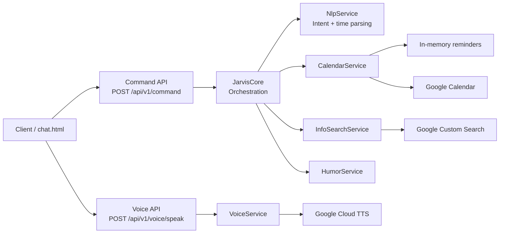

# Jarvis

[](https://github.com/romusio/Jarvis/actions/workflows/ci.yml)

Jarvis is an **extensible command and voice assistant backend** built with Java and Spring Boot. It accepts natural-language commands, classifies supported intents, orchestrates reminder/search workflows, and exposes optional Google Calendar and Google Text-to-Speech integrations behind provider abstractions.

> **Current architecture:** deterministic / rule-based command parsing. Jarvis does not currently depend on an LLM. The project is structured so richer NLP or an LLM provider can be introduced without replacing the HTTP, calendar, search, or voice boundaries.

## What it demonstrates

- modular Spring Boot backend design
- natural-language command parsing in Russian and English
- intent-based orchestration
- provider-based calendar and voice integrations
- Google Custom Search integration
- Google Calendar integration through Application Default Credentials
- Google Cloud Text-to-Speech integration
- REST APIs and a lightweight browser voice/chat client
- unit tests and automated GitHub Actions verification

## Architecture



## Command pipeline

```text
Natural-language input
        ↓
CommandController
        ↓
JarvisCore
        ↓
NlpService
        ↓
Intent
        ├── ADD_REMINDER → CalendarService
        ├── WEB_SEARCH   → InfoSearchService
        ├── SMALL_TALK   → response generation
        └── UNKNOWN      → fallback response
```

The parser currently uses explicit heuristics and regular expressions rather than opaque model inference. That makes the current behavior deterministic and easy to test while keeping the orchestration layer independent from the parsing implementation.

## Supported command examples

### Reminders

Russian and English reminder phrases are supported, including relative dates and durations:

```text
Напомни позвонить маме завтра в 10
Напомни проверить отчёт через 30 минут
Напомни тренировку сегодня в 19:30

Remind me to call John tomorrow at 10
Remind me to check the deployment in 2 hours
```

### Web search

Search intents include prefixes such as:

```text
поиск ...
найди ...
что такое ...
кто такой ...

search ...
find ...
what is ...
who is ...
```

### Small talk

The current parser also recognizes a small set of greeting/status intents in Russian and English.

## REST API

### Process command

```http
POST /api/v1/command
Content-Type: application/json
```

Request:

```json
{
  "text": "Напомни проверить релиз завтра в 10"
}
```

Response contains:

```text
reply
intent
data
```

### Synthesize speech

```http
POST /api/v1/voice/speak
Content-Type: text/plain
```

The endpoint delegates to the configured `VoiceService` provider. Without a speech provider configured, Jarvis uses the safe no-op implementation. With Google TTS enabled, the endpoint returns MP3 audio.

## Provider model

### Calendar

`CalendarService` has two current implementations:

- **memory** — default provider; stores reminders in memory
- **google** — creates events through Google Calendar API

Default behavior requires no external credentials.

Enable Google Calendar:

```bash
export GOOGLE_APPLICATION_CREDENTIALS=/path/to/google-credentials.json

./mvnw spring-boot:run \
  -Dspring-boot.run.jvmArguments="-Djarvis.calendar.provider=google -Djarvis.calendar.timezone=Europe/Moscow"
```

The Google implementation uses Application Default Credentials and the Calendar OAuth scope.

### Web search

Google Custom Search is optional. Without credentials, search returns an empty result set instead of preventing the application from starting.

```bash
export GOOGLE_API_KEY=your-api-key
export JARVIS_GOOGLE_CSE_ID=your-search-engine-id
```

### Voice / Text-to-Speech

The default voice provider is no-op. To enable Google Cloud Text-to-Speech:

```bash
export GOOGLE_APPLICATION_CREDENTIALS=/path/to/google-credentials.json
export JARVIS_VOICE_LANGUAGE=ru-RU

./mvnw spring-boot:run \
  -Dspring-boot.run.jvmArguments="-Djarvis.voice.provider=google"
```

## Browser client

A lightweight static chat client is included in the application:

```text
http://localhost:8082/chat.html
```

The browser UI can use the Web Speech API for client-side speech recognition and call the backend voice endpoint for synthesized responses.

## Technology stack

- Java 17
- Spring Boot 3.3.2
- Spring Web
- Jakarta Validation
- Maven Wrapper
- Java `HttpClient`
- Jsoup
- Jackson
- Google Auth Library
- Google Cloud Text-to-Speech
- Google Calendar REST API
- Google Custom Search JSON API
- JUnit / Spring Boot Test
- GitHub Actions

## Project structure

```text
src/main/java/com/example/jarvis/
├── calendar/      # calendar provider abstraction and implementations
├── config/        # provider configuration
├── controller/    # REST API
├── core/          # command orchestration
├── humor/         # response decoration
├── model/         # request / response / intent models
├── nlp/           # deterministic command parser
├── search/        # web search and page preview integration
└── voice/         # speech provider abstraction

src/main/resources/
├── application.properties
└── static/
    └── chat.html
```

## Build and test

Prerequisites:

- JDK 17+

Run the same verification used by CI:

```bash
bash ./mvnw clean verify
```

Start locally:

```bash
bash ./mvnw spring-boot:run
```

The application runs on:

```text
http://localhost:8082
```

## CI

GitHub Actions verifies the project on Java 17 for pushes and pull requests:

```text
Checkout
   ↓
Java 17 / Temurin
   ↓
Maven Wrapper
   ↓
clean verify
   ↓
Tests + package
```

## Engineering roadmap

Completed foundation:

- [x] command API and orchestration core
- [x] deterministic RU/EN intent parsing
- [x] relative reminder time parsing
- [x] in-memory calendar provider
- [x] Google Calendar provider
- [x] Google Custom Search provider
- [x] pluggable voice provider
- [x] Google Text-to-Speech provider
- [x] lightweight browser voice/chat client
- [x] automated Java 17 CI

Potential next iterations:

- [ ] replace `com.example` namespace with a project-owned package
- [ ] add OpenAPI / Swagger documentation
- [ ] introduce structured provider error handling instead of silent fallbacks
- [ ] expand controller and provider integration tests
- [ ] add persistent reminder storage
- [ ] containerize the application
- [ ] add metrics and health endpoints
- [ ] introduce an optional LLM/NLU provider behind the parsing boundary
- [ ] add conversation/session context
- [ ] add rate limiting and production-grade external API resilience

## Design principle

Jarvis is intentionally built around interfaces and orchestration boundaries rather than hard-wiring every external service into the command controller. The result is a small backend where parsing, calendars, search, speech, and future model providers can evolve independently.
